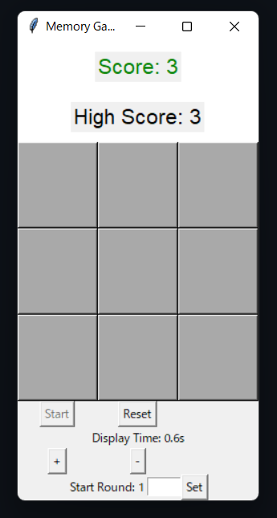

# Memory Game
[](https://www.codefactor.io/repository/github/mark0011astra/memorygame)  
This is a memory game built with Tkinter, where players are challenged to remember the sequence of highlighted cells. As the game progresses, the sequence becomes longer and more difficult to memorize.

# Ultimate Working Memory Booster

**The ultimate working memory enhancement software, maximizing efficiency through psychological, medical, academic, and mathematical perspectives.**

[](https://opensource.org/licenses/MIT)

## Overview

Application designed to effectively train your working memory. Based on principles from psychology, medicine, academic research, and mathematics, it aims to enhance your cognitive abilities. This software is more than just a game; it offers a scientific approach to unlock your brain's full potential.

## Key Features

*   **Adaptive Difficulty Adjustment:** Dynamically adjusts the game's difficulty according to your progress, ensuring an optimal level of challenge.
*   **Dual N-Back Task:** Implements a scientifically proven working memory training method to strengthen the core of your cognitive functions.
*   **Visual Feedback:** Provides immediate visual feedback upon correct or incorrect answers, facilitating learning.
*   **Detailed Statistics:** Records data such as play history, scores, and reaction times, allowing you to track your progress.
*   **Customizable Settings:** Allows you to adjust game speed, number of rounds, and other preferences to suit your needs.
*   **Break Reminders:** Prompts you to take periodic breaks to prevent fatigue from prolonged training.
*   **Beautiful User Interface:** Employs a simple and intuitive design to enhance focus and concentration.

## Scientific Basis

This software is grounded in the following scientific principles:

*   **Cognitive Load Theory:** Gradually increases the load on working memory without exceeding its limits.
*   **Neuroplasticity:** Leverages the brain's ability to change its structure and function through repetitive training.
*   **Dual-Task Paradigm:** Challenges the ability to process multiple pieces of information simultaneously through visual (and formerly auditory) elements.
*   **Statistical Learning:** Analyzes performance data to inform difficulty adjustments.

## Getting Started

### Prerequisites

*   Python 3.x
*   Tkinter (GUI library included with standard Python)

### Installation

1. Clone this repository:
    ```bash
    git clone https://github.com/yourusername/yourrepository.git
    ```
2. Navigate to the directory:
    ```bash
    cd yourrepository
    ```
3. Install the required libraries (if there are any additional dependencies):
    ```bash
    pip install -r requirements.txt
    ```

### How to Run

```bash
python main.py
---------------------


## 概要

`Ultimate Working Memory Booster` は、ワーキングメモリを効果的にトレーニングするために設計されたアプリケーションです。心理学、医学、学術研究、そして数学的原則に基づき、認知能力の向上を目指します。このソフトウェアは、単なるゲームではなく、脳の潜在能力を最大限に引き出すための科学的アプローチを提供します。

## 主な機能

*   **適応的な難易度調整:** ユーザーの進捗に合わせてゲームの難易度を動的に調整し、常に最適な挑戦レベルを維持します。
*   **Dual N-Back 課題:** 科学的に証明されたワーキングメモリトレーニング法を実装し、認知機能の中核を鍛えます。
*   **視覚的フィードバック:** 正誤に応じて即座に視覚的なフィードバックを提供し、学習を促進します。
*   **詳細な統計:** プレイ履歴、スコア、反応時間などのデータを記録し、自身の進捗を追跡できます。
*   **カスタマイズ可能な設定:** ゲームの速度、ラウンド数など、個人の好みに合わせた設定が可能です。
*   **休憩リマインダー:** 長時間のトレーニングによる疲労を防ぐため、定期的な休憩を促します。
*   **美しいユーザーインターフェース:**  集中力を高めるために、シンプルで直感的なデザインを採用しています。

## 科学的根拠

このソフトウェアは、以下の科学的原則に基づいています。

*   **認知負荷理論:**  ワーキングメモリの限界を超えないように、段階的に負荷を増やします。
*   **神経可塑性:**  反復的なトレーニングを通じて脳の構造と機能を変化させる能力を活用します。
*   **デュアルタスク:**  複数の情報を同時に処理する能力を鍛えるために、視覚的および（以前は）聴覚的な要素を組み合わせます。
*   **統計的学習:**  パフォーマンスデータを分析し、難易度調整に役立てます。

## 始め方

### 前提条件

*   Python 3.x
*   Tkinter (Pythonに標準で含まれるGUIライブラリ)

### インストール

1. このリポジトリをクローンします:
    ```bash
    git clone https://github.com/yourusername/yourrepository.git
    ```
2. ディレクトリに移動します:
    ```bash
    cd yourrepository
    ```
3. 必要なライブラリをインストールします (もし追加の依存関係がある場合):
    ```bash
    pip install -r requirements.txt
    ```

### 実行方法

```bash
python main.py
